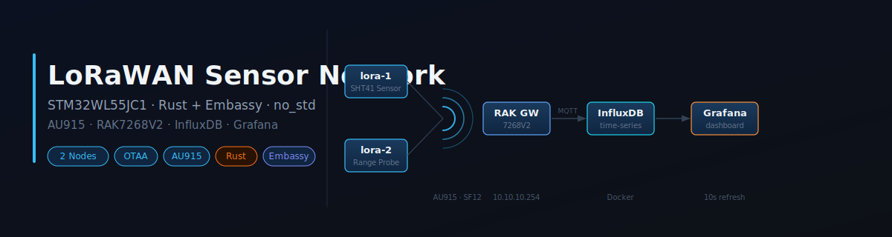
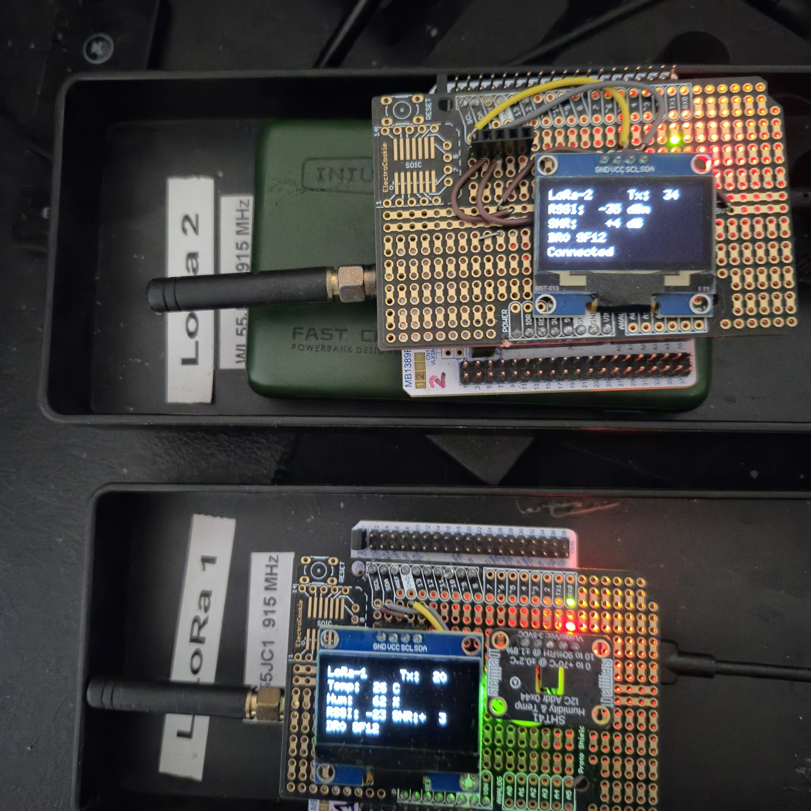
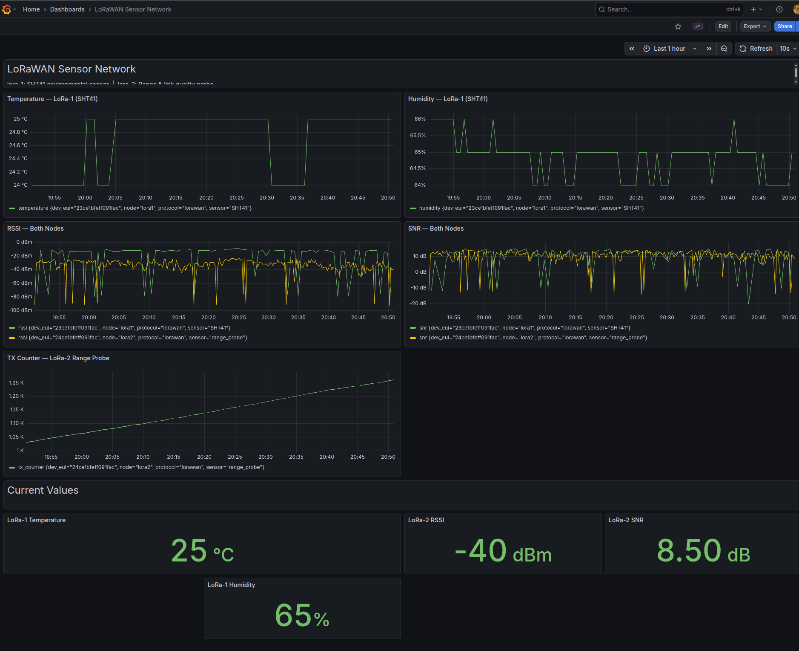

# LoRaWAN Sensor Network



A two-node LoRaWAN sensor network built on STM32WL55JC1 microcontrollers, running Rust/Embassy firmware, with a Docker-based backend for data ingestion and visualisation.

**lora-1** is an environmental sensor node (SHT41 — temperature and humidity).  
**lora-2** is a dedicated range-testing probe that reports radio link quality (RSSI, SNR, DR/SF) with no sensor attached.

---

## Hardware



| Board | Role | Sensor | Display | LoRaWAN Payload |
|-------|------|--------|---------|-----------------|
| lora-1 | Sensor node | SHT41 (temp + humidity) | SH1106 128×64 OLED | 4 bytes |
| lora-2 | Range probe | None | SH1106 128×64 OLED | 4 bytes (TX counter) |

**MCU**: STM32WL55JC1 on NUCLEO-WL55JC1 development board  
**Gateway**: RAK7268V2 WisGate Edge Lite 2 — AU915 sub-band 1, built-in LoRa Server + MQTT broker at `10.10.10.254`

---

## Firmware Stack

| Layer | Technology |
|-------|------------|
| Language | Rust (`no_std`, `no_main`) |
| Async runtime | Embassy 0.7 |
| LoRa PHY | `lora-phy` 3.0 (patched for `embassy-time` 0.4 compatibility) |
| LoRaWAN MAC | `lorawan-device` 0.12 (patched) |
| Target | `thumbv7em-none-eabihf` (STM32WL55, no FPU — integer math only) |

### Patched Crates

`lora-phy` and `lorawan-device` are pinned to local patches under `firmware/` to resolve an `embassy-time 0.4` API incompatibility with the published crate versions. Do not `cargo update` these without care.

---

## Backend Stack

| Service | Technology | Purpose |
|---------|------------|---------|
| MQTT broker | RAK7268V2 built-in | Receives LoRaWAN uplinks from nodes |
| MQTT bridge | Python (`mqtt_to_influx.py`) | Subscribes to gateway MQTT, decodes payload, writes to InfluxDB |
| Time-series DB | InfluxDB 2.x | Stores all sensor and radio metrics |
| Visualisation | Grafana 10.x | Live dashboard, 10s refresh |
| Containers | Docker Compose | Runs InfluxDB, Grafana, local Mosquitto, MQTT bridge |

---

## Project Structure

```
firmware/
├── lora-1/                   # Sensor node (SHT41 + SH1106)
│   ├── src/main.rs           # Main firmware
│   └── src/iv.rs             # RF switch interface variant
├── lora-2/                   # Range probe (SH1106 only)
│   ├── src/main.rs           # Main firmware
│   └── src/iv.rs             # RF switch interface variant
├── lora-phy-patched/         # lora-phy patched for embassy-time 0.4
└── lorawan-device-patched/   # lorawan-device patched for embassy-time 0.4
grafana/
├── dashboards/               # Provisioned Grafana dashboard JSON
└── provisioning/             # Datasource + dashboard autoload config
mosquitto/
└── config/mosquitto.conf     # Local broker config (for offline testing)
docker-compose.yml            # Backend services
mqtt_to_influx.py             # MQTT → InfluxDB bridge
NOTES.md                      # Deep technical notes (LoRaWAN internals, bug history)
```

---

## Reproducing This Project

Follow these steps in order to go from zero to live data in Grafana.

---

### Step 1 — Prerequisites

#### Rust toolchain

```bash
curl --proto '=https' --tlsv1.2 -sSf https://sh.rustup.rs | sh
rustup target add thumbv7em-none-eabihf
```

#### probe-rs (flash and debug tool for embedded targets)

```bash
cargo install probe-rs-tools --locked
```

#### Docker + Docker Compose

Install Docker Desktop (Mac/Windows) or Docker Engine + Compose plugin (Linux). Verify:

```bash
docker compose version
```

#### Clone this repo

```bash
git clone <repo-url>
cd lora
```

---

### Step 2 — Configure the RAK7268V2 Gateway

Access the gateway admin UI at `http://10.10.10.254` and complete the following.

#### 2a. Set the LoRaWAN region and sub-band

- Navigate to: **Network Server → Gateway → LoRa Network → Region**
- Set region to **AU915**
- Set sub-band / channel mask to **sub-band 1** (channels 0–7 uplink + channel 64)

#### 2b. Create the application

- Navigate to: **Network Server → Applications → Add**
- Name: `TOT`
- Confirm the MQTT integration is enabled (it is by default on the RAK built-in server)

#### 2c. Register lora-1

Inside the TOT application, click **Add Device**:

| Field | Value |
|-------|-------|
| Device name | `lora-1` |
| DevEUI | `23ce1bfeff091fac` |
| AppEUI (Join EUI) | `b130a864c5295356` |
| AppKey | `b726739b78ec4b9e9234e5d35ea9681b` |
| Class | A |
| ADR | Enabled |

#### 2d. Register lora-2

Repeat with:

| Field | Value |
|-------|-------|
| Device name | `lora-2` |
| DevEUI | `24ce1bfeff091fac` |
| AppEUI (Join EUI) | `b130a864c5295356` |
| AppKey | `b726739b78ec4b9e9234e5d35ea9681b` |
| Class | A |
| ADR | Enabled |

> The AppEUI and AppKey are shared between both devices in this setup.

---

### Step 3 — Adapt Credentials (if using different keys)

If you register your own devices with different EUIs or a different AppKey, update the constants at the top of each `src/main.rs`:

```rust
// DevEUI stored LSB-first (reverse of what the gateway shows)
const DEV_EUI: [u8; 8] = [0xAC, 0x1F, ...]; // reverse of your DevEUI

// AppEUI stored LSB-first (reverse of what the gateway shows)
const APP_EUI: [u8; 8] = [0x56, 0x53, ...]; // reverse of your AppEUI

// AppKey stored MSB-first (same order as the gateway shows)
const APP_KEY: [u8; 16] = [0xB7, 0x26, ...];
```

Byte order rule:

- DevEUI and AppEUI: reverse the hex string from the gateway UI byte-by-byte
- AppKey: copy directly, no reversal

---

### Step 4 — Start the Backend

```bash
./start_services.sh
```

This starts four Docker containers: InfluxDB, Grafana, Mosquitto, and the MQTT bridge.

| Service | URL | Credentials |
|---------|-----|-------------|
| Grafana | http://localhost:3000 | admin / admin |
| InfluxDB | http://localhost:8086 | admin / admin123456 |

The Grafana dashboard is provisioned automatically from `grafana/dashboards/unified-dashboard.json` — no manual import needed.

To stop all services:
```bash
./stop_services.sh
```

---

### Step 5 — Flash the Boards

Build and flash each board. With both connected simultaneously, specify the probe serial:

```bash
# lora-1
cd firmware/lora-1
cargo build --release
probe-rs run --chip STM32WL55JCIx --probe 0483:374e:003E00463234510A33353533 target/thumbv7em-none-eabihf/release/lora-1

# lora-2
cd firmware/lora-2
cargo build --release
probe-rs run --chip STM32WL55JCIx --probe 0483:374e:0026003A3234510A33353533 target/thumbv7em-none-eabihf/release/lora-2
```

With a single board connected, `cargo run --release` is enough — probe-rs will find it automatically.

---

### Step 6 — Verify the Pipeline

**Watch the defmt log** (attach without reflashing):
```bash
# lora-1
probe-rs attach --chip STM32WL55JCIx --probe 0483:374e:003E00463234510A33353533

# lora-2
probe-rs attach --chip STM32WL55JCIx --probe 0483:374e:0026003A3234510A33353533
```

Expected log sequence after boot:
```
✓ LoRa radio initialized
✓ AU915 region configured (sub-band 1)
OTAA join attempt 1 ...
✓ LoRaWAN joined successfully!
✓ Uplink sent: RxComplete | DR0 SF12 SNR:+4 RSSI:-87
```

**Check the MQTT bridge is receiving uplinks:**
```bash
docker logs unified-mqtt-bridge -f
```
Expected output:
```
[14:32:01] lora1: Temp=23.4C Hum=61.2% RSSI=-87 SNR=4 -> InfluxDB: OK
```

Open Grafana at <http://localhost:3000> → Dashboards → LoRaWAN Unified. Data should appear within one uplink cycle (~10–30s depending on the board).

---

## LoRaWAN Configuration

| Parameter | Value |
|-----------|-------|
| Region | AU915 |
| Sub-band | 1 (channels 0–7 + 64) |
| Join mode | OTAA |
| Join sub-band bias | Sub-band 1, 20 noncompliant retries |
| Initial join backoff | 16s |
| Max join backoff | 60s |
| Uplink interval | lora-1: every ~30s (15 ticks × 2s) |
| Uplink interval | lora-2: every ~10s (5 ticks × 2s) |
| Confirmed uplinks | lora-1: every 5th TX; lora-2: every TX |
| Gateway loss detection | 3 consecutive missed ACKs → rejoin |

### Device EUIs

| Board | DevEUI |
|-------|--------|
| lora-1 | `23ce1bfeff091fac` |
| lora-2 | `24ce1bfeff091fac` |

### EUI Byte Order

DevEUI and AppEUI are stored **LSB-first** (reversed) in firmware. AppKey is **MSB-first**. This matches the over-the-air LoRaWAN byte order required by `lorawan-device`.

### Payload Format

**lora-1** (4 bytes, big-endian):

| Bytes | Field | Type | Scale |
|-------|-------|------|-------|
| 0–1 | Temperature | `i16` | × 100 °C |
| 2–3 | Humidity | `u16` | × 100 % |

**lora-2** (4 bytes, big-endian):

| Bytes | Field | Type | Notes |
|-------|-------|------|-------|
| 0–3 | TX counter | `u32` | Increments each uplink — used to measure packet loss at the gateway |

---

## OLED Display

Both boards show live status on a 128×64 SH1106 OLED:

**lora-1** (sensor node):
```
LoRa-1     Tx:  42
Temp:  23 C
Hum:   61 %
RSSI: -87 SNR: +4
DR2 SF10
```

**lora-2** (range probe):
```
LoRa-2     Tx:  17
RSSI:  -92 dBm
SNR:    +3 dB
DR0 SF12
Connected
```

While not yet joined, line 1 shows `Join: N` (attempt counter) and line 5 shows `Connecting...`.  
After gateway loss is detected (3 missed ACKs), the display reverts to `Connecting...` and the node begins rejoining with exponential backoff.

---

## Gateway Loss Detection

LoRaWAN gives nodes no passive notification when a gateway goes offline — the radio is one-directional on uplinks. Detection relies entirely on confirmed uplinks:

- **lora-2** sends every uplink as confirmed. If 3 consecutive ACKs are missed (~30s), it drops back to `Connecting...` and begins rejoining.
- **lora-1** sends a confirmed uplink every 5th TX. The failure counter only increments on missed ACKs (not unconfirmed uplinks) and only resets when a confirmed ACK is received. Detection takes up to 3 confirmed-uplink cycles (~7.5 min worst case).

> **Why unconfirmed uplinks can't detect gateway loss:**  
> `lorawan-device` returns `Ok(SendResponse::RxComplete)` for unconfirmed uplinks regardless of whether the gateway received them — there is no ACK to wait for. Only `Ok(SendResponse::NoAck)` from a confirmed uplink proves the gateway is unreachable.

---

## Data Flow

```
STM32WL55 node
    │  LoRaWAN OTAA (AU915 sub-band 1)
    ▼
RAK7268V2 gateway  (10.10.10.254)
    │  MQTT  application/TOT/device/<deveui>/rx
    ▼
mqtt_to_influx.py  (Docker container)
    │  Decodes base64 payload, writes line protocol
    ▼
InfluxDB 2.x  (measurement: lorawan_sensor)
    │  tags: node, dev_eui, sensor   fields: temperature, humidity, rssi, snr, frame_count
    ▼
Grafana dashboard  (10s refresh)
```

### MQTT Topics

```
application/TOT/device/23ce1bfeff091fac/rx   # lora-1 uplinks
application/TOT/device/24ce1bfeff091fac/rx   # lora-2 uplinks
```

---

## Grafana Dashboard



The unified dashboard gives a live view of the full network at a glance:

- **Temperature / Humidity** (top row) — lora-1 SHT41 readings; temperature is stable around 25 °C, humidity fluctuates as expected indoors
- **RSSI / SNR** (middle row) — both nodes overlaid; steady around −85 to −95 dBm / +4 to +8 dB with occasional deep spikes indicating a missed RX window, not sustained loss
- **TX Counter** (lower left) — lora-2 range probe; a continuously incrementing line with no gaps confirms zero packet loss over the observation window
- **Current Values** (stat panels) — latest readings at a glance: temperature, humidity, RSSI, and SNR

The dashboard auto-provisions from `grafana/dashboards/unified-dashboard.json` on first start — no manual import needed.

---

## LoRaWAN Concepts

### Spreading Factor and Data Rate

AU915 uplink data rates (sub-band 1, 125 kHz):

| DR | SF | Max payload | Time-on-air (12B) |
|----|----|-------------|-------------------|
| DR0 | SF12 | 59 bytes | ~1500 ms |
| DR1 | SF11 | 59 bytes | ~740 ms |
| DR2 | SF10 | 59 bytes | ~370 ms |
| DR3 | SF9 | 123 bytes | ~185 ms |
| DR4 | SF8 | 250 bytes | ~100 ms |
| DR5 | SF7 | 250 bytes | ~50 ms |

Nodes always join at DR0 (SF12) for maximum range. ADR (Adaptive Data Rate) steps up to higher DRs as the gateway builds SNR history.

### SNR Decoding Thresholds

LoRa can decode below 0 dB SNR — this is what gives it exceptional range:

| SF | Minimum SNR |
|----|-------------|
| SF12 | −20 dB |
| SF11 | −17.5 dB |
| SF10 | −15 dB |
| SF9 | −12.5 dB |
| SF8 | −10 dB |
| SF7 | −7.5 dB |

---

## Troubleshooting

### probe-rs: Device or resource busy (os error 16)

A previous debug session is still attached to the ST-LINK probe.

```bash
pkill -f "probe-rs"
```

Then retry the flash or attach command.

---

### Board not joining — OLED shows `Join: N` indefinitely

**Check gateway is reachable:**
- Confirm the RAK7268V2 is powered and on the network (`ping 10.10.10.254`)
- Open the RAK gateway UI and verify the LoRa Server is running

**Check the application is registered:**
- Gateway UI → Applications → TOT → Devices
- Both DevEUIs (`23ce1bfeff091fac`, `24ce1bfeff091fac`) must be listed
- AppEUI and AppKey must match the values in `src/main.rs`

**Check sub-band:**
- Gateway must be configured for AU915 sub-band 1
- Firmware uses `set_join_bias_and_noncompliant_retries(Subband::_1, 20)` — first 20 join attempts stay on sub-band 1 before rotating

**Watch the defmt log:**
```bash
probe-rs attach --chip STM32WL55JCIx --probe <probe-serial>
```
Look for `✗ No join accept` (wrong credentials or gateway not responding) vs `✗ Join error` (radio fault).

---

### Board shows `Connecting...` after having been joined

The node detected 3 consecutive missed ACKs and triggered a rejoin. Causes:

- Gateway was powered off or lost network connectivity
- Node moved out of RF range
- Transient RF interference causing multiple consecutive packet loss

The node will rejoin automatically with exponential backoff (16s → 60s cap). Power-cycling the gateway will cause the same behaviour — wait for the gateway to finish booting, then the node rejoins within ~16–60s.

---

### No data appearing in Grafana

Work through the pipeline from the bottom up:

**1. Is the MQTT bridge running?**
```bash
docker logs unified-mqtt-bridge --tail 50
```
Look for `Connected to MQTT broker at 10.10.10.254:1883` and incoming `[HH:MM:SS] lora1: Temp=...` lines.

**2. Is InfluxDB receiving data?**
```bash
docker logs unified-influxdb --tail 20
```
Or open http://localhost:8086 → Data Explorer → `sensors` bucket → `lorawan_sensor` measurement.

**3. Is the MQTT bridge reaching the gateway?**  
The bridge connects directly to the RAK gateway MQTT broker (`10.10.10.254:1883`), not the local Mosquitto. Verify network routing from the Docker host to `10.10.10.254`.

**4. Is the gateway forwarding uplinks to MQTT?**  
Gateway UI → Applications → TOT → Live LoRaWAN Frames. Uplinks should appear here within seconds of a node transmitting.

**5. Restart the bridge if needed:**
```bash
docker restart unified-mqtt-bridge
docker logs unified-mqtt-bridge -f
```

---

### Grafana shows "No data" for a panel

- Check the InfluxDB datasource is healthy: Grafana → Connections → Data sources → InfluxDB → Test
- Verify the time range in the top-right corner of the dashboard — default may be set to last 1h and no recent data exists
- Confirm the `node` tag filter matches `lora1` or `lora2` (lowercase, no hyphen) in the panel query

---

### Board is joined but RSSI/SNR frozen on display

RSSI and SNR are only updated when a downlink is received. For lora-1 this happens on every 5th (confirmed) uplink; for lora-2 on every uplink. If the values haven't changed in a while the link is still alive — the gateway simply isn't sending MAC downlinks between confirmed uplinks.

---

### `cargo build` fails with linker or embassy-time errors

Do not run `cargo update` in the firmware directories. The patched crates under `firmware/lora-phy-patched/` and `firmware/lorawan-device-patched/` pin `embassy-time` to 0.4.0. Running `cargo update` will pull in a newer version and break the build.

If the build is broken after an update, restore the `Cargo.lock` from git:
```bash
git checkout firmware/lora-1/Cargo.lock firmware/lora-2/Cargo.lock
```

---

### ADR not stepping up from DR0

The node will stay at DR0 (SF12) until the network server has accumulated enough SNR history and sends a `LinkADRReq` downlink.

- Confirm ADR is enabled on the gateway: Gateway UI → Applications → TOT → Device → ADR enabled
- ADR requires approximately 20 uplinks before the server has enough data to act
- SNR must have sufficient margin above the DR0 minimum (−20 dB) — at +4 to +7 dB the margin is 24–27 dB, more than enough
- Watch the OLED: once ADR kicks in, line 5 on lora-1 will change from `DR0 SF12` → `DR1 SF11` → ... over successive uplinks

---

## Field Testing

lora-2 is purpose-built for range testing — it sends a confirmed uplink every ~10s, displays RSSI, SNR, and DR live on the OLED, and the TX counter in Grafana shows exactly where packet loss occurred. lora-1 runs simultaneously and provides corroborating data at 30s intervals.

---

### Pre-flight Checklist

Before leaving the building:

- Both OLEDs show `Tx: N` (counter incrementing) — not `Connecting...`
- Backend is running (`./start_services.sh`)
- Grafana is accessible and the dashboard is showing live data
- Note the **baseline RSSI and SNR** at the gateway location — this is your reference
- Note the current **DR/SF** on lora-2 (should be `DR0 SF12` until ADR steps up)
- Take a USB power bank — the NUCLEO boards power from USB

---

### What to Watch During the Test

#### lora-2 OLED (primary instrument)

| Field | What to watch |
|-------|--------------|
| `Tx: N` | Counter must keep incrementing — gaps mean missed ACKs |
| `RSSI: dBm` | Gets more negative as range increases |
| `SNR: dB` | Drops toward and then below 0 dB near the limit |
| `DR / SF` | Changes if ADR steps up (good signal) or steps down (weakening) |
| `Connecting...` | 3 consecutive ACKs missed — you are at or past the coverage edge |

#### Grafana (monitor remotely or review after)

Open the LoRaWAN dashboard and watch these panels for `node=lora2`:

- **RSSI over time** — should degrade smoothly as you walk away
- **SNR over time** — watch for it crossing 0 dB
- **Frame count** — gaps in the counter reveal exactly which uplinks were lost and when
- **DR** — any change here is a `LinkADRReq` from the gateway

---

### Reading the Numbers

#### RSSI

| RSSI | Link quality |
|------|-------------|
| Better than −90 dBm | Excellent — well within range |
| −90 to −105 dBm | Good |
| −105 to −115 dBm | Marginal — nearing the limit |
| Below −115 dBm | At the edge — packet loss likely at SF12 |

#### SNR

SF12 (DR0) can decode down to **−20 dB SNR** — this is LoRa's defining characteristic. You will typically lose packets when SNR falls below the minimum for the current SF before RSSI becomes the limiting factor.

| SF (DR) | Minimum decodable SNR |
|---------|-----------------------|
| SF12 (DR0) | −20 dB |
| SF10 (DR2) | −15 dB |
| SF8 (DR4) | −10 dB |
| SF7 (DR5) | −7.5 dB |

> If RSSI is −110 dBm but SNR is still +2 dB, the link is healthy. If SNR drops to −18 dB, you are close to the decoding limit regardless of RSSI.

#### Packet loss

Grafana frame count gaps give the exact loss rate. A single missed ACK is normal (transient obstruction). Three in a row triggers a rejoin — the OLED will switch to `Connecting...` until the board rejoins (16–60s backoff).

#### ADR stepping up

The gateway needs ~20 uplinks of SNR history before it sends a `LinkADRReq`. At close range with +4 to +7 dB SNR, ADR should eventually push lora-2 from DR0 (SF12) all the way to DR5 (SF7). Watch line 4 on the OLED — each step is a confirmed downlink from the gateway.

---

### Test Procedure

1. **Start at the gateway.** Note baseline RSSI, SNR, DR.
2. **Walk slowly** — lora-2 sends every ~10s, so pause ~30s at each test point to collect 2–3 readings before moving on.
3. **Mark your waypoints** — note location description, RSSI, SNR, and whether ACKs were received.
4. **Find the edge** — the coverage boundary is where `Connecting...` first appears consistently.
5. **Walk back** — the board will rejoin and resume within ~16–60s once you return to coverage. Confirm the TX counter resumes from where it left off (session keys are preserved across a rejoin).
6. **Review in Grafana** — the full walk is captured in InfluxDB. Check frame count gaps against your waypoint notes to calculate loss rate at each distance.

---

### Real-World Results — 2026-04-28, Suburban Brisbane

Gateway mounted on rooftop (85 m altitude). lora-2 walked outward. All signal data from InfluxDB — 246 uplinks captured. See [NOTES.md](NOTES.md) for full analysis.

| Waypoint | Distance | Altitude | RSSI | SNR | Status |
|----------|----------|----------|------|-----|--------|
| Home / Gateway | 0 m | 63 m | −17 dBm | +13.8 dB | Excellent |
| WP2 | 63 m | 77 m | −70 dBm | +9.5 dB | Good |
| Local church | 256 m | 89 m | −89 dBm | +4.2 dB | Good — near GW elevation |
| WP4 | 380 m | 87 m | −102 dBm | −6.5 dB | Marginal |
| WP5 | 466 m | 82 m | −103 dBm | −19.5 dB | **At SF12 limit** |
| WP6 | 593 m | 75 m | −103 dBm | −20.8 dB | **Packet loss** |
| WP7 (downhill) | 716 m | 48 m | −103 dBm | −19.2 dB | **Terrain masking** |
| WP8 (uphill) | 743 m | 64 m | −96 dBm | +0.5 dB | Recovered (+16 m climb) |
| WP9 | 921 m | 77 m | −103 dBm | −13.2 dB | Marginal — furthest point |

**Key finding:** elevation relative to the gateway dominated over raw distance. WP8 (743 m away) had better signal than WP7 (716 m away) purely because it was 16 m higher — line-of-sight restored after a downhill dip blocked the Fresnel zone. In open rural terrain, expect 5–15 km from an elevated gateway.

---

### Tips

- **Elevation beats distance** — gateway placement on the highest available structure (silo, water tower, ridge) is the single biggest range multiplier. This was confirmed directly in field testing: climbing 16 m recovered the link at greater distance.
- **Buildings attenuate heavily** — a single brick wall can cost 10–15 dB. Go outdoors for true range figures.
- **Record GPS + time only** — InfluxDB stores every uplink with a timestamp. Overlay your waypoints on the Grafana timeline after the walk; no need to manually log signal values in the field.
- **lora-1 runs simultaneously** — carry both boards for a second data stream to cross-check in Grafana.
- **AU915 SF12 theoretical range** in open rural terrain: 5–15 km with elevated gateway. Dense suburban: 400–900 m.

See [NOTES.md](NOTES.md) for the full waypoint table, gap analysis, and Fresnel zone explanation.

---

## Probe Serial Numbers

| Board | Probe Serial |
|-------|-------------|
| lora-1 | `0483:374e:003E00463234510A33353533` |
| lora-2 | `0483:374e:0026003A3234510A33353533` |

---

## Further Reading

See [NOTES.md](NOTES.md) for detailed documentation on:

- Join/rejoin algorithm and backoff rationale
- Sub-band bias (`set_join_bias_and_noncompliant_retries`)
- BME688 I2C bus contention issue and why lora-2 uses no sensor
- SH1106 OLED driver constraints (`flush()` behaviour, I2C transaction size)
- ADR internals and what to watch during range testing
- Rust + Embassy design rationale on bare-metal STM32
- The patched crates situation and `embassy-time` version pinning
